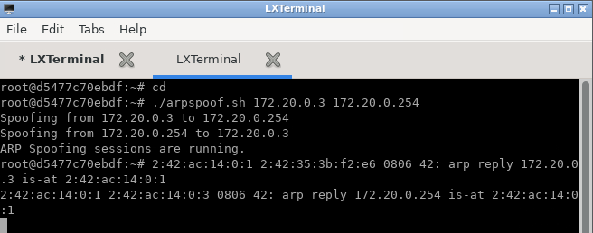
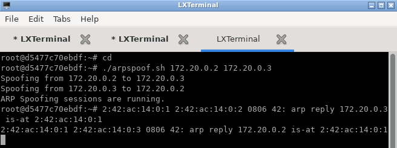

<h2>Table of Contents</h2>

- [Goal](#goal)
- [Description](#description)
- [Technical Specifications](#technical-specifications)
  - [More About Docker](#more-about-docker)
- [How to Run](#how-to-run)
  - [About IPs and MAC Addresses](#about-ips-and-mac-addresses)
  - [Step 1: Host Discovery](#step-1-host-discovery)
  - [Step 2: ARP Spoofing](#step-2-arp-spoofing)
    - [Victim 1 Container](#victim-1-container)
    - [Victim 2 Container](#victim-2-container)
    - [Attacking Container](#attacking-container)
    - [Victim 1 Container](#victim-1-container-1)
    - [Victim 2 Container](#victim-2-container-1)
  - [Step 3: Traffic Monitoring](#step-3-traffic-monitoring)
- [Cheat Sheet](#cheat-sheet)
  - [Docker Actions](#docker-actions)
- [Authors](#authors)

## Goal

This project involves developing a man-in-the-middle attack to capture the web browsing history of a remote target computer. The project is divided into three main stages:

Host Discovery: Develop a tool to identify active hosts in the network by performing a scan similar to a ping sweep, mapping the connected devices.

Execution of the Attack: After identifying the target host, execute an ARP Spoofing attack with man-in-the-middle using the arpspoof tool, inserting the attacker into the communication flow between the target and the router.

Traffic Monitoring: Create an application to monitor the web browsing traffic of the target host, capturing HTTP and DNS packets to track the browsing history.

The goal is to intercept and analyze network traffic to capture the target’s web activity.

## Description

This project involves using a sniffer program like Wireshark to monitor the entire network traffic of a host and analyze its content. By inspecting DNS and HTTP packets, it’s possible to reconstruct the web browsing history of a device. However, this typically requires physical access to the host. To remotely monitor other devices on a local network, a man-in-the-middle attack can be employed, exploiting common vulnerabilities in local networks.

In this project, ARP Spoofing will be used to intercept network traffic and monitor the web browsing history of the target hosts. The implementation is divided into three main stages:

Development of the Scanning Application: Create a tool to identify active hosts in the local network (Annex I).

Execution of ARP Spoofing with Man-in-the-Middle: Set up an attack that places the attacker between the target host and the router (Annex II).

Development of Traffic Analysis Application: Create a tool to capture and analyze the web browsing history of the attacked hosts (Annex III).

The objective is to intercept and analyze the network traffic to reconstruct the target’s web browsing history.

For more specific business rules and project description, please refer to the [full document](T2_20242.pdf).

## Technical Specifications

This project was developed using [Python](https://www.python.org/) with [Docker](#docker) containers.

### More About [Docker](https://www.docker.com/)

Docker is used to create containers for the application and the database. It is used to create a development environment that is as close as possible to the production environment.
It is highly recommended to use Docker to run the application.

We have a [`Dockerfile`](Dockerfile) that contains the configuration for the application container and a [`docker-compose`](docker-compose.yml) file which builds three instances of the application.

For some useful Docker commands, [click here](#docker-actions).

## How to Run

Now that you have all the necessary tools installed, you can run the application.
To start the application with Docker, simply run the following command:

```bash
$ docker compose up --build -d
```

That's it! You should now have three instances of the application running on your machine, on ports 8080, 8081, and 8082.

### About IPs and MAC Addresses

We have configured static IPs for the containers to make it easier to understand the network and not have to manually check the IPs every time. The IPs are as follows:
The MAC addresses also don't appear to change, but they were not set manually, so maybe this column is different for you, maybe not.
Here is a table with the IPs and MAC addresses of the containers:

| Nickname  | IP Address  | MAC Address        | Container Name             |
|-----------|-------------|--------------------|----------------------------|
| Gateway   | 172.0.0.254 | 02:42:d1:60:f5:29  | -                          |
| Attacker  | 172.0.0.1   | 02:42:ac:14:00:01  | tf_arpspoofing-labredes1-1 |
| Victim 1  | 172.0.0.2   | 02:42:ac:14:00:02  | tf_arpspoofing-labredes2-1 |
| Victim 2  | 172.0.0.3   | 02:42:ac:14:00:03  | tf_arpspoofing-labredes3-1 |

To get the updated container IPs and MAC Addresses, you can run the following command on your original environment (the one you ran the `docker compose up` command):

```bash
$ scripts/get-container-ips.sh
```

To follow the next steps, you will need to access the containers and open the LXTerminal, which should be the third icon on the tray.
To access the application machines, simply go to:
[Attacker Machine (localhost:8080)](localhost:8080)
[Victim Machine (localhost:8081)](localhost:8081)
[Gateway Machine (localhost:8082)](localhost:8082)

To check that everything appears to be working, you can run the following commands:

```bash
# Go to root
$ cd
# Check the files (you should see the python project files)
$ ls
```

### Step 1: Host Discovery

To check which hosts are active in the network, you can run the following command in any of the containers:

```bash
$ python3 host_discovery.py <network/mask> <timeout_ms>
```

Obs.: <network/mask> has to follow the network IP address, not the host IP address, so for example: `172.20.0.0/24` if the host IP is `172.20.0.4`. It is important to note that the network IP address is the same for all containers, so you can use the same <network/mask> for all of them, in this case, `172.20.0.0/24`.
The <timeout_ms> is the time in milliseconds that the program will wait for a response from the hosts.

Should return something like this:


### Step 2: ARP Spoofing

#### Victim 1 Container

```bash
# Ping other victim (to generate traffic)
$ ping 172.20.0.3 -c 3
# Send a request to the outside through the gateway (to generate traffic)
$ curl -so /dev/null http://example.com
# Check the ARP table
$ arp -n
```

Should return something like this:


#### Victim 2 Container

```bash
# Ping other victim (to generate traffic)
$ ping 172.20.0.2 -c 3
# Send a request to the outside through the gateway (to generate traffic)
$ curl -so /dev/null http://example.com
# Check the ARP table
$ arp -n
```

Should return something like this:


#### Attacking Container

Start 3 terminals in the attacking container and run the following commands in each one:

```bash
# Attack victim 1 and gateway connection
$ ./arpspoof.sh 172.20.0.2 172.20.0.254
```

```bash
# Attack victim 2 and gateway connection
$ ./arpspoof.sh 172.20.0.3 172.20.0.254
```

```bash
# Attack victim 1 and victim 2 connection
$ ./arpspoof.sh 172.20.0.2 172.20.0.3
```

You should these outputs:





#### Victim 1 Container

```bash
# Check the ARP table
$ arp -n
```

Now the ARP table should have the attacker's MAC address associated with the gateway's and the other victim's IP address, returning something like this:


#### Victim 2 Container

```bash
# Check the ARP table
$ arp -n
```

Now the ARP table should have the attacker's MAC address associated with the gateway's and the other victim's IP address, returning something like this:


### Step 3: Traffic Monitoring

To monitor the traffic, you can run the following command in the attacking container:

```bash
$ python3 traffic_sniffer.py
```

## Cheat Sheet

### Docker Actions

```bash
# Build the containers
$ docker compose up --build

# List all containers
$ docker ps

# Access the container
$ docker exec -it {{container_id}} sh

# Stop the containers
$ docker compose down
```

## Authors

- [Carolina Ferreira](https://github.com/carolmicfer)
- [Felipe Freitas Silva](https://github.com/felipefreitassilva)
- [Luiza Heller Kroeff Plá](https://github.com/LuHellerKP)
- [Mateus Campos Caçabuena](https://github.com/mateuscacabuena)
